# Clearstock: contextual AI reader, translation, saved chats and daily learning

This release uses the existing Next.js + Supabase + configured Google Gemini model. It does not introduce a paid tool, vector database, orchestration framework or new authentication system.

## Try the product

1. Open News and sign in. **Update news** checks the fixed official SEC/Fed/BLS sources. One shared refresh every ten minutes; no AI call. Terminal alternative: `npm run sync:data -- --news-only`. `npm run sync:data` also updates financials and configured Alpaca IEX data. Refresh the browser after the terminal sync.
2. In a news article, select up to 160 characters. After a short debounce, Gemini explains the phrase in context. Choose Explain/Translate and English/简体中文. Explanations are capped at 200 English words / 600 Chinese characters and usually much shorter. Star **Save** explicitly keeps it in Notebook → Term explanations. “+ Rate” opens five Emoji scores; a tap saves immediately.
3. **Explain article / Translate article** opens a right-hand dialogue with a title-only article reference. Follow-up answers use the same source snapshot and up to four recent replies. Each answer has its own rating. **Save** keeps the whole chat in Notebook → AI conversations; **Unsave** removes it from that list without deleting history. Saved chats can be reopened, continued and downloaded as Markdown. Earlier single-answer chats remain under Earlier answers.
4. **Learn → Today** lazily creates one batch of five short learning articles on the first visit of each New York calendar day. Later visits reuse it. They are five distinct supported topics, selected from a versioned 33-topic bank with saved knowledge excluded and related topics preferred. Stars retain articles across days in **Learn → Saved**. Every article supports its own rating and generation-record download. Inactive users do not consume a daily model call.

These are educational explanations of available sources. SEC news pages contain saved filing excerpts and reported facts, not a guaranteed complete filing. Publisher pages contain their saved title/excerpt. The AI drawer explicitly records this scope. Neither new quotes nor unsupported price reaction claims are generated.

## Architecture and iteration

```mermaid
flowchart LR
  A[Select text / explain article / visit Learn] --> B[Next.js server: login, same-origin, bounded input]
  B --> C[Resolve authorized canonical source / notebook topic profile]
  C --> D[Versioned prompt + source snapshot + request hash]
  D --> E[Postgres reservation: shared quota and idempotency]
  E -->|Cache hit| H[Immutable saved AI output]
  E -->|New request| F[Configured Gemini generateContent]
  F --> G[JSON schema + citations + numeric/length checks]
  G --> I[Atomic output + usage + run completion]
  I --> H
  H --> J[Popup / conversation / five daily articles]
  J --> K[Own rating / explicit save under RLS]
```



- `lib/ai/prompt.mjs`: prompt versions `us-reader-v5` and `us-daily-v1`, bounded schemas, 0.2 temperature, explicit output caps, citation, numeric, complete-date and requested-language checks. Simple calls use 1200 max output tokens, article/chat 3000, daily five-article batch 5000. A token cap includes provider behavior and does not guarantee response length; the server validates length separately.
- `lib/ai/source.ts`: server resolves the source using the signed-in RLS client. A selected phrase must exist in that canonical article. Source evidence is retained through the saved filing excerpt, including later passages such as “939 warehouses”; it is not silently replaced by only the opening paragraphs.
- `lib/ai/topics.mjs`: supported definition/source bank and deterministic related-topic selection. Expand this file with reviewed definitions and official guide references. Gemini writes the simpler article and its relationship to the known topics. No browsing or invented company figures is needed for basic learning.
- `lib/ai/generate.mjs`: uses the configured `GEMINI_MODEL`, never automatically switches providers/models or enables billing. Stores prompt, schema, settings, normalized output, exact raw response text, model version, provider usage, validation version and content hash. Failed drafts remain private diagnostics and never appear as successful content.
- `generation_runs` remains the single model-call ledger for old and new features. Both reservations take advisory lock `716031`. Global daily cap comes from existing `AI_DAILY_LIMIT` (currently 20); new reader features allow at most twenty user attempts per Pacific day, within that global cap. Failed calls count, new calls are globally limited to five per minute, and rapid same-user calls are throttled. Cache hits bypass the new-call cap. Daily learning is one call for five articles, with a stable owner/date reservation.
- `lib/market/sync.mjs`: shared import routine used by both CLI and authenticated web refresh. Fixed allowed upstream hosts; bounded payloads/timeouts; shared database refresh cooldown; no user-controlled upstream URL and no Gemini. Partial failures retain earlier data and report the missing sources rather than clearing the feed. The web refresh runs only news sources, with an overall upstream time budget.

Rerunning a probabilistic model is **not guaranteed byte-identical**, even with the same settings. Reproducibility here means exact replay of the saved result and a complete recorded input/configuration for comparison. To iterate, change the prompt/validator version deliberately, keep older outputs immutable and compare outputs/ratings against their source snapshot. Existing ratings always remain tied to their original output ID. Daily sets remain fixed for that day so refreshed pages cannot silently replace rated content.

## Private data handling

- Gemini gets the source/article context, selected phrase or explicit question. Daily learning gets saved term labels, saved conversation titles, and allowlisted topic keys recognized locally from personal notes.
- Private note titles and bodies are not sent to Gemini. The first implementation examines the latest 200 saved terms/stars, 30 saved conversations and 30 active notes; this is a bounded recent-interest profile, not a claim to process an unlimited notebook.
- All six added tables enable RLS. Generated outputs, original prompts, conversations, daily sets, votes and stars are private. Client writes to AI outputs/conversation snapshots/generation runs are denied. Save endpoints authenticate and resolve the original stored output before persisting a bookmark. Ratings/star insert policies verify both the owner and accessible target.
- Google’s free API tier can use input/output to improve its products. The UI says this at the AI entry points. Do not use it for account identifiers, private holdings or sensitive personal information. This release does not upgrade billing or share content publicly.

## Database and setup

Apply once to the existing `hello-world-db`, after the prior three Clearstock migrations:

`supabase/migrations/202610080003_ai_reader.sql`, then `202610080004_reader_quota.sql`

It extends `generation_runs` kinds and owner checks; adds `ai_outputs`, `ai_conversations`, `ai_daily_sets`, `ai_lesson_saves`, `ai_feedback`, `news_refresh_gate`, owner policies, atomic reservation/completion functions, and a bookmark reference to its AI output. Historical data is kept. The follow-up migration allows a user up to twenty attempts within the same global pool; the global daily cap remains unchanged.

Existing environment variables remain in `.env.local`: public Supabase URL/key, server-only Supabase secret, `GEMINI_API_KEY`, `GEMINI_MODEL`, `AI_FREE_TIER_ENABLED`, `AI_DAILY_LIMIT`, `SEC_USER_AGENT`. Never commit or expose server keys. `npm run check:setup` now checks the additional schema too. Model metadata access does not prove billing status or remaining free quota; consult the active AI Studio limits before changing the cap.

## Replay

Download a generated answer’s **Generation record** JSON, then:

```
npm run replay:ai -- /absolute/path/to/clearstock-ai-OUTPUT_ID.json
```

This replays the saved explanation without credentials, a Google call or a database write. The JSON includes the canonical source, exact prompt, requested model/configuration and provider usage. Conversation Markdown contains every saved question and validated answer; older responses that fail current checks are marked unavailable, with their immutable originals retained in the generation JSON; per-answer JSON preserves reproducibility for that message.

## Validation

Automated checks: pure prompt/source/length/numeric/candidate/privacy tests; real PostgreSQL/PGlite migration, owner isolation, invalid/forged votes, lesson-star rules, shared-budget reuse, atomic conversation revisions and five-output completion; lint; production build; localhost anonymous/cross-origin API guards. Real provider/browser verification is recorded below after completion.

## Deployment status

Local implementation uses the production Supabase schema, but Vercel is not updated by this release. Set the same server-only environment variables in Vercel and deploy the reviewed code. Prepared GitHub news refresh workflows are still not enabled; until then use the News button or CLI. No deployment protection or billing setting has been changed.

## Official references

- [Google Gemini structured output](https://ai.google.dev/gemini-api/docs/structured-output): schema-guided results still require application validation.
- [Gemini pricing and free-tier data use](https://ai.google.dev/gemini-api/docs/pricing).
- [Gemini active rate limits](https://ai.google.dev/gemini-api/docs/rate-limits): quotas vary by model/project.
- [SEC financial statement guide](https://www.sec.gov/about/reports-publications/investorpubsbegfinstmtguide).
- [Investor.gov stocks](https://www.investor.gov/introduction-investing/investing-basics/investment-products/stocks).

## Real verification on 2026-10-08

- Applied reader migrations 003 and 004 to the existing Supabase project. A production read-only catalog check found 21 application tables, all with RLS enabled.
- Signed-in browser + configured Gemini: selected “939 warehouses” in the Costco filing explanation, generated a short Chinese explanation and translation, explicitly saved the explanation to Notebook and persisted a 4/5 vote.
- Generated a Chinese whole-article explanation, a follow-up about SKU versus inventory turnover, and a full translation of the available article. The final translator fixes mixed English and the SEC non-affiliate shareholder terminology; original date/number strings or equivalent complete dates are checked against evidence. Saved the full conversation, persisted a per-reply vote, and reopened it from Notebook.
- Generated five distinct Chinese daily articles in one successful batch: Inventory, Management discussion and analysis, Financial statement footnotes, Year-to-date figures and Fiscal year. Starred Inventory, rated it 4/5, opened Learn → Saved and reloaded: only that starred article remained and the score persisted.
- The first daily draft repeated a number from an interest label. It failed validation and was never published. Daily version us-daily-v1 strips digits from interest labels and explicitly treats them as interests, not financial evidence. Article source/version checks also caught earlier wrong-language and wrong-date drafts; these originals remain private diagnostics, and old invalid conversation replies are masked in both UI and Markdown export.
- Clicked Update news: refreshed the six-company SEC and official RSS coverage, checked/imported 103 available updates (not 103 newly published stories), advanced the displayed checked time, and verified the shared ten-minute cooldown.
- Downloaded the whole saved conversation as Markdown, confirming that all seven questions remain and four earlier drafts failing current checks are marked unavailable. Downloaded a generation record through the signed-in browser and replayed the exact saved answer offline with no credentials, provider request or database write.
- Final lint, production build, 34 pure tests, onboarding checks, 27 PostgreSQL/PGlite scenarios, localhost authentication/origin checks and setup/schema/provider-metadata checks passed.

Useful real generated explanations, one saved term, one saved conversation and one starred article remain in the current account for demonstration. Private exported generation files are kept outside the repository.

Known limits: topic matching uses a bounded local definition bank; it is not an unlimited semantic recommender. Source, date, numeric and language checks catch common failures, but do not certify every model interpretation. Translations can retain original dates, acronyms or source vocabulary. The real translation received a 3/5 pilot rating, while the contextual explanation and daily Inventory lesson received 4/5. These scores are tied to their exact output versions.
